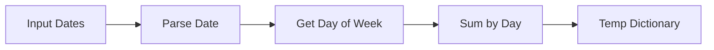

# 📅 Day of Week Value Aggregator

> A JavaScript solution for aggregating date-based values by day of week with intelligent interpolation for missing days.


---

## 📋 Table of Contents

- [Problem Statement](#-problem-statement)
- [Features](#-features)
- [Examples](#-examples)
- [Algorithm](#-algorithm)
- [Usage](#-usage)
- [Performance](#-performance)
- [Edge Cases](#-edge-cases)

---

## 🎯 Problem Statement

Transform a dictionary of date-value pairs into a weekly summary:

**Input Format:**
```javascript
{
  'YYYY-MM-DD': integer_value,
  ...
}
```

**Output Format:**
```javascript
{
  'Mon': aggregated_value,
  'Tue': aggregated_value,
  ...
  'Sun': aggregated_value
}
```

### 📐 Requirements

| Requirement | Description |
|------------|-------------|
| **Aggregation** | Sum all values that fall on the same day of the week |
| **Interpolation** | Calculate missing days using linear interpolation |
| **Date Range** | `1970-01-01` to `2100-01-01` |
| **Value Range** | `-1,000,000` to `1,000,000` |
| **Guarantee** | At least `Mon` and `Sun` will be present |

---

## ✨ Features

- ⚡ **Fast**: O(n) time complexity
- 🔄 **Smart Interpolation**: Automatically fills missing days
- 🌍 **Timezone Safe**: Uses UTC parsing
- 🎯 **Accurate**: Handles negative values and wrapping
- 📦 **Lightweight**: No external dependencies

---

## 📊 Examples

### Example 1: Basic Aggregation

Multiple dates on the same weekday are summed together.

**Input:**
```javascript
{
  '2020-01-01': 4,   // Wednesday
  '2020-01-02': 4,   // Thursday
  '2020-01-03': 6,   // Friday
  '2020-01-04': 8,   // Saturday
  '2020-01-05': 2,   // Sunday
  '2020-01-06': -6,  // Monday
  '2020-01-07': 2,   // Tuesday
  '2020-01-08': -2   // Wednesday (again!)
}
```

**Output:**
```javascript
{
  'Mon': -6,
  'Tue': 2,
  'Wed': 2,    // ✅ 4 + (-2) = 2
  'Thu': 4,
  'Fri': 6,
  'Sat': 8,
  'Sun': 2
}
```

---

### Example 2: With Missing Days 🔮

Missing days are intelligently interpolated based on surrounding values.

**Input:**
```javascript
{
  '2020-01-01': 6,   // Wednesday
  '2020-01-04': 12,  // Saturday
  '2020-01-05': 14,  // Sunday
  '2020-01-06': 2,   // Monday
  '2020-01-07': 4    // Tuesday
}
```

**Visual Representation:**
```
Wed → ??? → ??? → Sat → Sun → Mon → Tue
 6      ?     ?    12    14     2     4
       Thu   Fri
```

**Interpolation Calculation:**

| Day | Calculation | Result |
|-----|-------------|--------|
| **Thu** | `6 + (12-6) × 1/3` | `8` ✨ |
| **Fri** | `6 + (12-6) × 2/3` | `10` ✨ |

**Output:**
```javascript
{
  'Mon': 2,
  'Tue': 4,
  'Wed': 6,
  'Thu': 8,   // 🔮 Interpolated
  'Fri': 10,  // 🔮 Interpolated
  'Sat': 12,
  'Sun': 14
}
```

---

## 🧮 Algorithm

### Step 1️⃣: Parse & Aggregate



**Process:**
1. Parse each date string to determine day of week
2. Sum all values for the same weekday
3. Store in temporary dictionary

**Complexity:** `O(n)` where n = number of input dates

---

### Step 2️⃣: Linear Interpolation

For each missing day:

```
interpolatedValue = prevValue + (nextValue - prevValue) × (position / gap)
```

**Where:**
- `prevValue` = Value of previous known day
- `nextValue` = Value of next known day  
- `position` = Steps from previous day to current day
- `gap` = Total steps between previous and next day

**Example Calculation:**

```
Wed(6) → Thu(?) → Fri(?) → Sat(12)
         ↑        ↑
         p=1      p=2
         
gap = 3 days

Thu = 6 + (12-6) × 1/3 = 6 + 2 = 8
Fri = 6 + (12-6) × 2/3 = 6 + 4 = 10
```

**Complexity:** `O(7) = O(1)` - maximum 7 days to check

---

## 💻 Usage

### Basic Usage

```javascript
function solution(D) {
    // Implementation here
}

// Example
const input = {
    '2020-01-01': 6,
    '2020-01-04': 12,
    '2020-01-05': 14,
    '2020-01-06': 2,
    '2020-01-07': 4
};

const result = solution(input);
console.log(result);
```

**Output:**
```javascript
{
  Mon: 2,
  Tue: 4,
  Wed: 6,
  Thu: 8,
  Fri: 10,
  Sat: 12,
  Sun: 14
}
```

---

## ⚡ Performance

| Metric | Value |
|--------|-------|
| **Time Complexity** | `O(n)` |
| **Space Complexity** | `O(1)` |
| **Iterations** | Single pass + 7 days max |
| **Dependencies** | Zero |

### Performance Characteristics

- ✅ Single pass through input data
- ✅ Minimal memory overhead (always 7 output keys)
- ✅ No external libraries required
- ✅ Efficient date parsing with UTC

---

## 🛡️ Edge Cases

Our solution handles all these scenarios:

| Edge Case | How It's Handled |
|-----------|------------------|
| **Multiple dates on same weekday** | ✅ Values are summed |
| **Consecutive missing days** | ✅ Linear interpolation creates smooth transition |
| **Week wrapping (Sun→Mon)** | ✅ Modulo arithmetic handles wrapping |
| **Negative values** | ✅ Interpolation works correctly |
| **All days present** | ✅ No interpolation needed |
| **Timezone issues** | ✅ UTC parsing prevents bugs |

---

## 🔧 Implementation Details

### Day Mapping

```javascript
JavaScript Date.getUTCDay() returns:
0 = Sunday
1 = Monday
2 = Tuesday
3 = Wednesday
4 = Thursday
5 = Friday
6 = Saturday
```

### Date Parsing

```javascript
// ✅ Correct - UTC parsing
new Date('2020-01-01' + 'T00:00:00Z')

// ❌ Avoid - Local timezone
new Date('2020-01-01')
```

---

## 📚 Key Concepts

### Linear Interpolation Explained

Linear interpolation creates a straight line between two points:

```
    Next (12)
      /
     / 
    /  Fri (10)
   /
  /  Thu (8)
 /
Prev (6)
```

The formula ensures smooth, proportional transitions between known values.

---


<div align="center">

**Made with ❤️ for efficient date aggregation**

[⬆ Back to Top](#-day-of-week-value-aggregator)

</div>